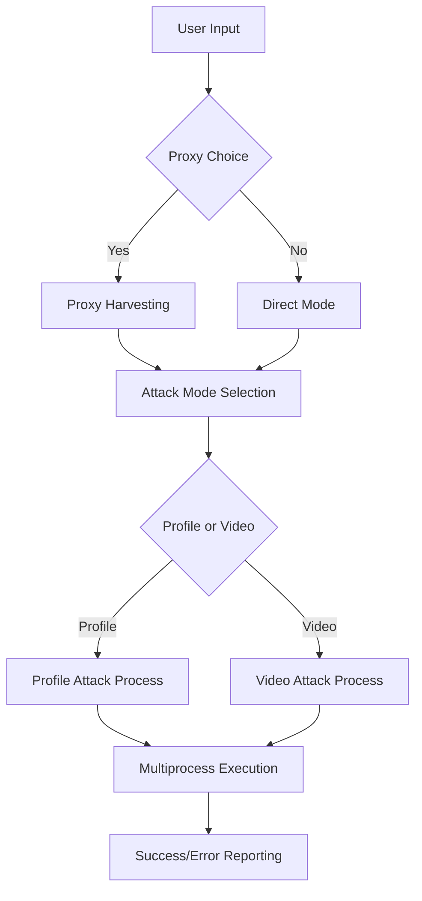

# 🎯 InstaReporter  
  
<div align="center">  
  
```  
╭━━╮╱╱╱╱╱╭╮╱╱╱╭━━━╮╱╱╱╱╱╱╱╱╱╱╭╮  
╰┫┣╯╱╱╱╱╭╯╰╮╱╱┃╭━╮┃╱╱╱╱╱╱╱╱╱╭╯╰╮  
╱┃┃╭━╮╭━┻╮╭╋━━┫╰━╯┣━━┳━━┳━━┳┻╮╭╋━━┳━╮  
╱┃┃┃╭╮┫━━┫┃┃╭╮┃╭╮╭┫┃━┫╭╮┃╭╮┃╭┫┃┃┃━┫╭╯  
╭┫┣┫┃┃┣━━┃╰┫╭╮┃┃┃╰┫┃━┫╰╯┃╰╯┃┃┃╰┫┃━┫┃  
╰━━┻╯╰┻━━┻━┻╯╰┻╯╰━┻━━┫╭━┻━━┻╯╰━┻━━┻╯  
╱╱╱╱╱╱╱╱╱╱╱╱╱╱╱╱╱╱╱╱╱┃┃  
╱╱╱╱╱╱╱╱╱╱╱╱╱╱╱╱╱╱╱╱╱╰╯  
```  
  
**🚀 Advanced Instagram Content Reporting Automation Tool**  
  
*Streamline your content moderation workflow with intelligent proxy rotation and multiprocessing*  
  
[](https://python.org)  
[](LICENSE)  
[](https://github.com/muneebwanee/InstaReporter)  
  
</div>  
  
---  
  
## 🌟 Features  
  
### 🎯 **Dual Attack Modes**  
- **Profile Reporting**: Target specific Instagram user profiles  
- **Video Content Reporting**: Report individual video posts  
  
### ⚡ **High-Performance Architecture**  
- **Multiprocessing Engine**: Up to 5 concurrent processes for maximum efficiency  
- **Smart Load Distribution**: Automatic proxy chunking (10 proxies per process)  
- **Intelligent Fallback**: No-proxy mode with 10 requests per process  
  
### 🛡️ **Advanced Anonymity System**  
- **Dynamic Proxy Support**: Built-in proxy harvesting from internet sources  
- **Custom Proxy Lists**: Support for user-provided proxy files (max 50)  
- **User Agent Rotation**: 90+ realistic browser user agents  
- **Protocol Intelligence**: Automatic HTTP/HTTPS proxy configuration  
  
### 🎨 **Professional User Interface**  
- **Colorized Console Output**: Beautiful terminal interface with status indicators  
- **Real-time Progress Tracking**: Live transaction monitoring  
- **Error Handling**: Comprehensive error reporting with detailed diagnostics  
  
---  
  
## 🚀 Quick Start  
  
### Prerequisites  
  
```bash  
# Python 3.7 or higher required  [1](#header-1)
python --version  
```  
  
### Installation  
  
1. **Clone the repository**  
```bash  
git clone https://github.com/muneebwanee/InstaReporter.git  
cd InstaReporter  
```  
  
2. **Install dependencies**  
```bash  
pip install requests colorama asyncio proxybroker  
```  
  
3. **Run the application**  
```bash  
python InstaReporter.py  
```  
  
---  
  
## 📋 Usage Guide  
  
### 🎯 **Interactive Mode**  
  
The application provides an intuitive step-by-step interface:  
  
1. **Proxy Configuration**  
   - Choose to use proxies or run without them  
   - Auto-harvest proxies from the internet  
   - Or provide your own proxy list file  
  
2. **Attack Mode Selection**  
   - `1` - Report Instagram profiles  
   - `2` - Report Instagram videos  
  
3. **Target Specification**  
   - Enter the username (for profiles)  
   - Enter the video URL (for videos)  
  
### 📁 **Proxy File Format**  
  
Create a text file with one proxy per line:  
```  
proxy1.example.com:8080  
proxy2.example.com:3128  
192.168.1.100:8080  
```  
  
---  
  
## 🏗️ Architecture Overview  
  
### 🔧 **Core Components**  
  
- **Main Orchestrator** (`InstaReporter.py`): Process management and user interaction  
- **Attack Engine** (`libs/attack.py`): HTTP request handling and form submission  
- **Proxy Harvester** (`libs/proxy_harvester.py`): Automatic proxy discovery  
- **Utility Suite** (`libs/utils.py`): Console interface and file operations  
  
### 🔄 **Workflow Architecture**  
  

  
### 🎯 **Attack Process Flow**  
  
1. **Session Initialization**: Create HTTP session with proxy configuration  
2. **Authentication Chain**: Facebook → Instagram cookie extraction  
3. **Form Parameter Extraction**: Dynamic token and session data parsing  
4. **Report Submission**: POST request to Instagram's help infrastructure  
5. **Response Validation**: Success/error status verification  
  
---  
  
## ⚙️ Configuration  
  
### 🔧 **Performance Tuning**  
  
| Parameter | Default | Description |  
|-----------|---------|-------------|  
| Max Processes | 5 | Concurrent attack processes |  
| Proxies per Process | 10 | Proxy distribution ratio |  
| No-Proxy Requests | 10 | Fallback request count |  
| HTTP Timeout | 10s | Request timeout duration |  
  
### 🛡️ **Security Features**  
  
- **Dynamic User Agents**: Automatic browser user agent rotation  
- **Cookie Management**: Automatic session handling  
- **Error Resilience**: Comprehensive exception handling  
- **Protocol Flexibility**: HTTP/HTTPS proxy support  
  
---  
  
## 📊 System Requirements  
  
### 🖥️ **Minimum Requirements**  
- **OS**: Windows 7+, macOS 10.12+, Linux (any modern distro)  
- **Python**: 3.7 or higher  
- **RAM**: 512MB available memory  
- **Network**: Stable internet connection  
  
### 📦 **Dependencies**  
- `requests[socks]` - HTTP client with SOCKS proxy support  
- `colorama` - Cross-platform colored terminal text  
- `asyncio` - Asynchronous I/O operations  
- `proxybroker` - Proxy discovery and validation  
  
---  
  
## 🛠️ Development  
  
### 📁 **Project Structure**  
  
```  
InstaReporter/  
├── InstaReporter.py          # Main application entry point  
├── libs/  
│   ├── attack.py            # Core attack functionality  
│   ├── proxy_harvester.py   # Automatic proxy discovery  
│   ├── user_agents.py       # Browser user agent rotation  
│   ├── utils.py             # Utility functions  
│   ├── logo.py              # Branding and UI elements  
│   └── check_modules.py     # Dependency validation  
└── README.md                # This file  
```  
  
### 🔍 **Key Functions**  
  
- `chunks()`: Proxy list segmentation for multiprocessing  
- `profile_attack_process()`: Profile reporting worker  
- `video_attack_process()`: Video reporting worker  
- `report_profile_attack()`: Core profile attack logic  
- `report_video_attack()`: Core video attack logic  
  
---  
  
## ⚠️ Legal Disclaimer  
  
This tool is designed for **educational and research purposes only**. Users are responsible for:  
  
- ✅ Complying with Instagram's Terms of Service  
- ✅ Following local and international laws  
- ✅ Using the tool ethically and responsibly  
- ❌ Not engaging in harassment or malicious activities  
  
**The developers assume no responsibility for misuse of this software.**  
  
---  
  
## 🤝 Contributing  
  
We welcome contributions! Here's how you can help:  
  
1. **🍴 Fork the repository**  
2. **🌿 Create a feature branch** (`git checkout -b feature/amazing-feature`)  
3. **💾 Commit your changes** (`git commit -m 'Add amazing feature'`)  
4. **📤 Push to the branch** (`git push origin feature/amazing-feature`)  
5. **🔄 Open a Pull Request**  
  
### 🐛 **Bug Reports**  
Found a bug? Please open an issue with:  
- Detailed description  
- Steps to reproduce  
- Expected vs actual behavior  
- System information  
  
---  
  
## 📞 Support & Contact  
  
<div align="center">  
  
**👨‍💻 Producer: Muneeb**  
  
[](https://instagram.com/muneebwanee)  
[](https://github.com/muneebwanee)  
[](mailto:muneebwanee@gmail.com)  
  
</div>  
  
---  
  
## 📄 License  
  
This project is licensed under the **Educational License** - see the [LICENSE](LICENSE) file for details.  
  
---  
  
<div align="center">  
  
**⭐ If this project helped you, please give it a star! ⭐**  
  
*Made with ❤️ by [Muneeb](https://github.com/muneebwanee)*  
  
</div>
